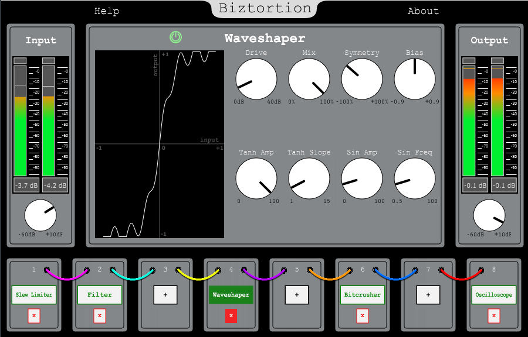

# Biztortion

 Modular distortion plugin for VST-based hosts made with C++ and JUCE framework.
 
 The software in question is designed to carry out very creative sound design, providing various very useful tools mainly for the production of **Electronic Dance Music**, without however excluding a possible use related to audio post-production.
 
 Windows/MacOS installers of the software, both 32 bit and 64 bit, are available for ****FREE DOWNLOAD**** in the [releases section](https://github.com/killbizz/Biztortion/releases/).
 
 
 
 This repository contains the thesys project for the bachelor degree in Electronic Music of Gabriel Bizzo at the C. Pollini Conservatory of Music in Padua (Italy).
 The thesys document, wrote in Italian language, contains an in-depth study on the phenomenon of audio distortion and a technical analysis of the different algorithms implemented in the plugin.
 
 ## Features

- Chain together the modules available in the **chain section** for a complex sound processing
- Have fun **dragging modules** to different chain positions, creating different combinations that give life to new sounds
- **Input/Output Stage** for a total dynamics control
- **Waveshaper Module** : distort the input signal using the transfer function which uses the sine and arctangent functions to create very complex waveforms
- **Bitcrusher Module** : reduce the resolution of the signal by adjusting the sampling frequency and bit depth. This gradually introduces the digital artifacts typical of older digital samplers
- **Slew Limiter Module** : this type of signal processor is usually present in analog modular synthesizers and allows you to level a signal so that the intensity variation cannot exceed a certain value per second
- In each distortion module you can decide whether to apply the effect to the whole signal or to the single upper or lower section of it. Use the "symmetry" and "bias" parameters to decide how to apply the **asymmetry** in the algorithm
- **Filter Section** : use this module to shape the tone of the sound while distorting the signal at any free chain position
- **Oscilloscope Module** : this module allows you to view the waveform of the sound in any free chain position 

## Dependencies

- [JUCE Framework](https://github.com/juce-framework/JUCE): v6.1.0 (GNU GPLv3 License)
- [dRowAudio Module](https://github.com/killbizz/drowaudio) (MIT License)
- [ff_meters Module](https://github.com/ffAudio/ff_meters) (BSD 3 clause License)

## Installation

1. Download the required dependencies
2. Git clone this repository
3. Open the `Biztortion.jucer` file and point to the local location of the library dependencies in the module section
4. Click on the `Save and Open in IDE` button, build the project and run it in your favourite IDE

## License

Biztortion is licensed under the GNU GPLv3 license.
